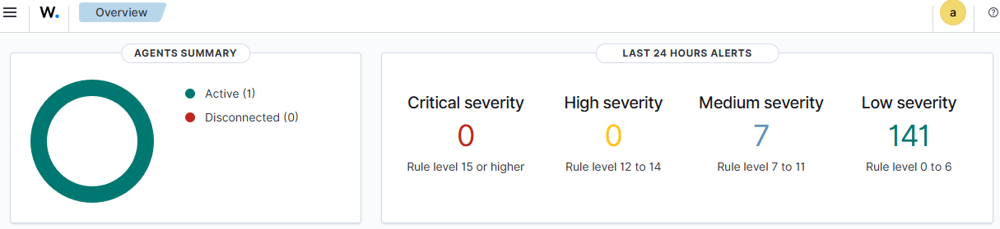
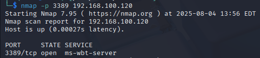
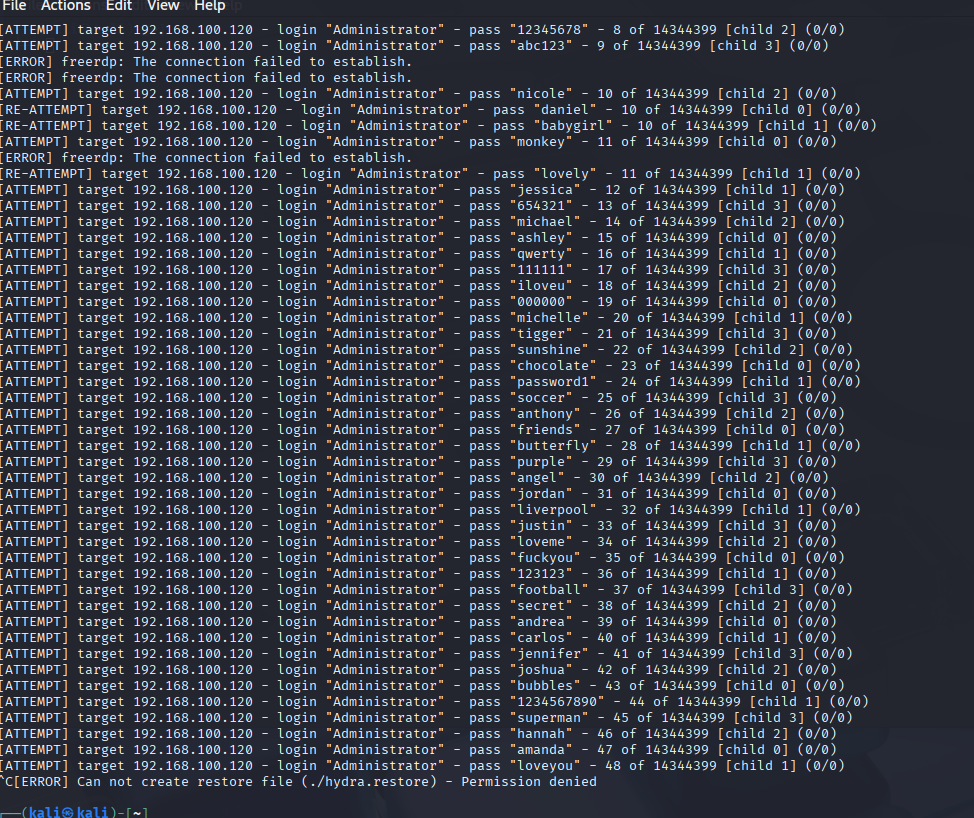
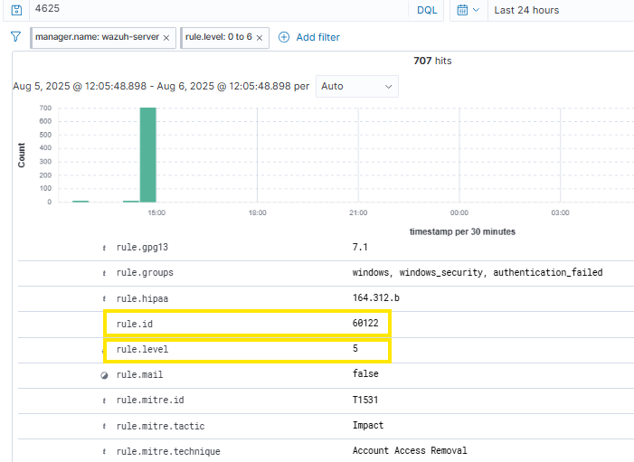
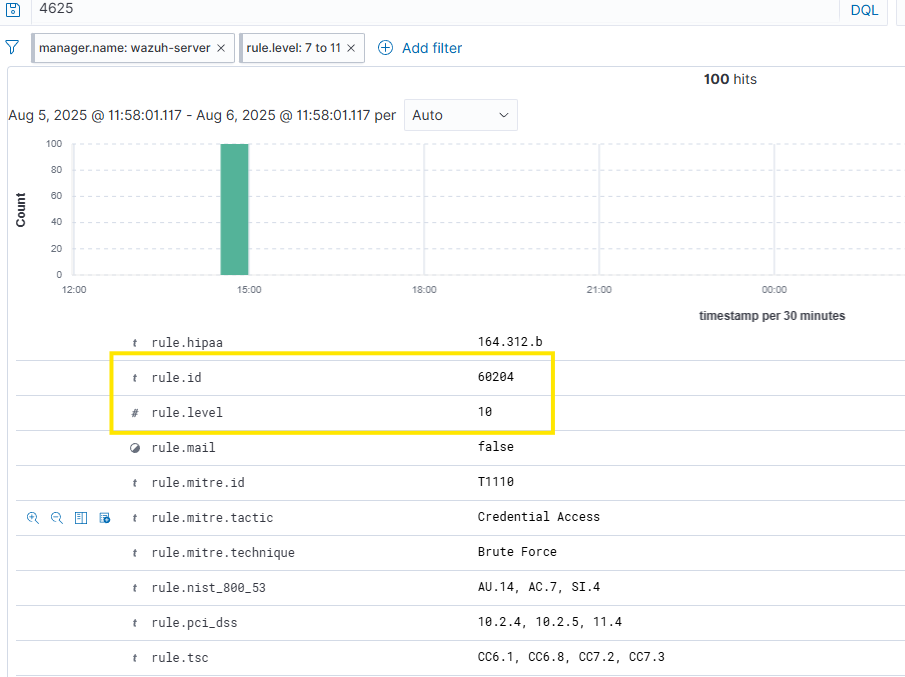
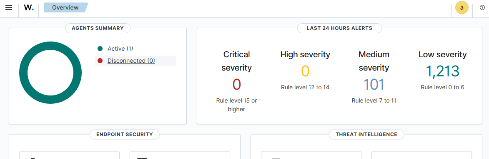

#  Laboratorio de Detección y Respuesta ante Ataque de Fuerza Bruta RDP usando Wazuh

---

##  Introducción

Este documento describe el diseño y despliegue de un entorno controlado para simular un ataque de fuerza bruta contra el servicio de Escritorio Remoto (RDP) en una máquina con Windows 10.  

El objetivo es generar actividad maliciosa detectable mediante múltiples intentos fallidos de autenticación, utilizando **Kali Linux** y la herramienta **Hydra** como origen del ataque.  

La máquina objetivo ejecuta un **agente Wazuh**, encargado de recolectar y enviar eventos de seguridad al servidor central **Wazuh Manager**, donde se lleva a cabo la correlación, clasificación y análisis.  

La actividad detectada se evalúa bajo el marco **MITRE ATT&CK**, específicamente la técnica **T1110.001 – Password Guessing**, y se prueba la capacidad del sistema para escalar alertas y activar respuestas automáticas frente a un patrón hostil persistente.

---

## Objetivos del laboratorio

- Simular y monitorear un ataque de fuerza bruta RDP con **Hydra** y **Wazuh**.
- Analizar la correlación y severidad de alertas generadas por Wazuh.


- Implementar y verificar una **respuesta automática (active-response)** ante el patrón detectado.
- Documentar evidencias y hallazgos técnicos de utilidad en entornos SOC.

---

## Infraestructura

| Máquina     | IP              | Rol                       |
|-------------|-----------------|---------------------------|
| Windows 10  | 192.168.100.120 | Objetivo, con Wazuh Agent |
| Ubuntu      | 192.168.100.129 | Servidor Wazuh            |
| Kali Linux  | 192.168.100.110 | Atacante (Hydra)          |

---

## Herramientas utilizadas

| Herramienta       | Descripción                                 |
|-------------------|---------------------------------------------|
| Wazuh 4.12.0         | Plataforma SIEM/EDR para detección y respuesta |
| Hydra             | Herramienta de fuerza bruta para RDP         |
| Kali Linux        | Sistema atacante con herramientas ofensivas  |
| Windows 10 Pro    | Sistema víctima con RDP y agente Wazuh       |
| MITRE ATT&CK      | Marco de referencia para clasificar TTPs     |
| Nmap              | Escaneo de puerto RDP para confirmar visibilidad previa al ataque |

---

## Línea base antes del ataque

Antes de ejecutar el ataque, se estableció una línea base del entorno para validar que no existieran eventos de alta criticidad ni actividad anómala en el servicio RDP.

- El panel de overview muestra un agente activo, sin alertas críticas ni severas en las últimas 24 horas.



---

## Verificación de puerto RDP con Nmap

Previo a la ejecución del ataque, se utilizó la herramienta **Nmap** desde Kali Linux para validar que el servicio RDP (puerto 3389/TCP) estuviera activo y accesible desde la red.

Comando utilizado:

```bash

nmap -p 3389 192.168.100.120 

```


## Ejecución del ataque con Hydra

Desde la máquina atacante (Kali Linux), se ejecutó un ataque de fuerza bruta contra el servicio RDP de la máquina Windows 10 utilizando la herramienta Hydra.  
El objetivo fue forzar múltiples intentos de inicio de sesión fallidos en un corto periodo de tiempo, generando así un patrón detectable por Wazuh.

Comando utilizado:
```bash
 hydra -t 1 -V -f -u -l Administrator -P /usr/share/wordlists/rockyou.txt rdp://192.168.100.120

```


---

## Detección y análisis inicial en Wazuh

Tras ejecutar el ataque de fuerza bruta desde Kali Linux, Wazuh comenzó a registrar múltiples eventos relacionados con intentos fallidos de inicio de sesión en la máquina Windows 10.  
Los eventos generados fueron del tipo **Event ID 4625**, correspondiente a _"An account failed to log on"_, que en Windows indica un intento fallido de autenticación.

Estos eventos fueron detectados por el agente Wazuh instalado y enviados al Wazuh Manager para su análisis.

Al revisar los registros desde la interfaz, se observó lo siguiente:

- Algunos eventos fueron clasificados con **nivel de severidad 5 (`rule.level: 5`)**, considerados fallos de autenticación comunes e individuales.

  

- Otros eventos se clasificaron con **nivel de severidad 10 (`rule.level: 10`)**, incluso si no apuntaban a usuarios privilegiados.  
  Esto se debe a la activación de una regla de correlación **(ID 60204)** que detecta múltiples eventos del grupo `authentication_failed` desde una misma IP en un corto intervalo de tiempo.

  

Este comportamiento revela que Wazuh sí aplica una correlación automatizada cuando se cumplen ciertos criterios definidos en sus reglas internas.  
En particular:

- La regla **60122** identifica eventos 4625 como fallos de autenticación y los agrupa bajo `authentication_failed`.
- La regla **60204** detecta múltiples eventos de este grupo desde una misma IP en menos de 240 segundos, elevando la alerta a **`rule.level: 10`** y asociándola a la técnica **T1110 – Brute Force** del marco MITRE ATT&CK.


---

Este comportamiento evidencia que, aunque Wazuh detecta correctamente los eventos 4625, no los correlaciona automáticamente como un ataque de fuerza bruta,
 ya que su lógica de detección se basa en la evaluación individual de cada evento, sin considerar:

- Volumen acumulado de eventos
- Frecuencia de ocurrencia
- IP de origen común



Esta observación da paso a la siguiente etapa: el diseño de una regla personalizada que permita correlacionar estos eventos como un único incidente de severidad **alta**.

---

##  Implementación de regla personalizada

En base en los hallazgos anteriores, se desarrolló una regla personalizada en `local_rules.xml`, con el objetivo de correlacionar múltiples intentos fallidos de autenticación (event ID 4625) desde una misma IP y usuario en un periodo de 2 minutos.

La regla asigna **nivel de severidad 12** y se alinea con la técnica **T1110.001 - Password Guessing vía RDP** del marco MITRE ATT&CK.

```xml
<group name="windows_security, brute_force, authentication_failed">
  <rule id="100111" level="12" frequency="5" timeframe="120">
    <if_matched_sid>60122</if_matched_sid>
    <same_source_ip />
    <same_user />
    <description>Brute-force RDP attack detected(EventID 4625): 5+ failures from same IP/user</description>
    <mitre>
      <id>T1110.001</id>
    </mitre>
    <group>rdp, brute_force, authentication_failed</group>
  </rule>
</group>
```

##  Validación de la regla personalizada

Una vez implementada la regla en `local_rules.xml`, se repitió el ataque de fuerza bruta desde la máquina atacante, simulando múltiples intentos fallidos de autenticación contra el servicio RDP del host Windows 10, desde la misma IP y usuario en un intervalo breve.

Como resultado, Wazuh generó una alerta con nivel de severidad **12**, indicando que la regla personalizada fue aplicada correctamente.