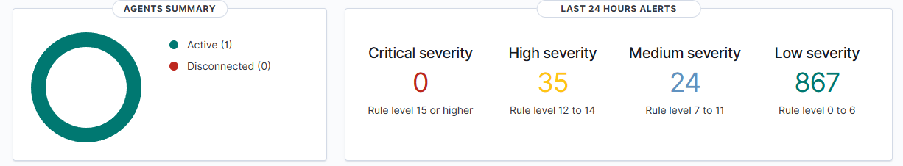
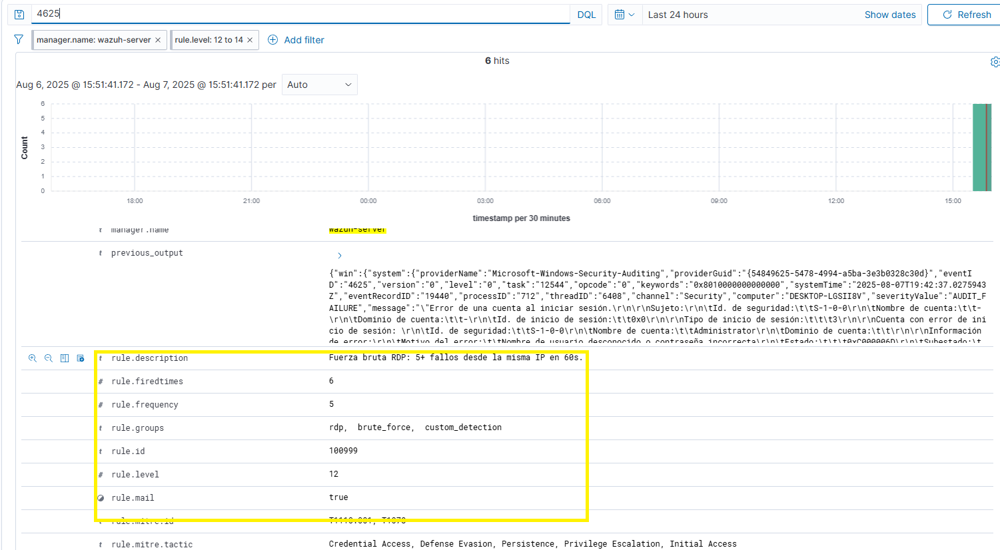

#  Laboratorio de Detección y Respuesta ante Ataque de Fuerza Bruta RDP usando Wazuh

---

##  Introducción

Este documento describe el diseño y despliegue de un entorno controlado para simular un ataque de fuerza bruta contra el servicio de Escritorio Remoto (RDP) en una máquina con Windows 10.  

El objetivo es generar actividad maliciosa detectable mediante múltiples intentos fallidos de autenticación, utilizando **Kali Linux** y la herramienta **Hydra** como origen del ataque.  

La máquina objetivo ejecuta un **agente Wazuh**, encargado de recolectar y enviar eventos de seguridad al servidor central **Wazuh Manager**, donde se lleva a cabo la correlación, clasificación y análisis.  

La actividad detectada se evalúa bajo el marco **MITRE ATT&CK**, específicamente la técnica **T1110.001 – Password Guessing**, y se prueba la capacidad del sistema para escalar alertas y activar respuestas automáticas frente a un patrón hostil persistente.

---

## Objetivos del laboratorio

- Simular un ataque de fuerza bruta RDP desde Kali Linux usando Hydra.
- Detectar los intentos de autenticación fallida con Wazuh.
- Evaluar las reglas de correlación predeterminadas.
- Implementar una regla personalizada para mejorar la detección.
- Asignar severidad crítica y técnicas MITRE al patrón de ataque.
- Validar la efectividad de la detección.
- Proponer medidas de mitigación aplicables en un entorno SOC.

---

## Infraestructura del laboratorio

El entorno se compone de tres máquinas virtuales conectadas en red local, cada una con un rol específico dentro del escenario de ataque y monitoreo.

| Sistema        | IP              | Rol                              | Descripción breve                    |
|----------------|-----------------|----------------------------------|--------------------------------------|
| Windows 10 Pro | 192.168.100.120 | Víctima                          | Servicio RDP habilitado y agente Wazuh |
| Ubuntu 22.04   | 192.168.100.129 | Wazuh Manager                    | Servidor central de recolección y análisis de eventos |
| Kali Linux     | 192.168.100.110 | Atacante                         | Ejecución de fuerza bruta con Hydra |


---

## Herramientas utilizadas

| Herramienta       | Descripción                                 |
|-------------------|---------------------------------------------|
| Wazuh 4.12.0         | Plataforma SIEM/EDR para detección y respuesta |
| Hydra             | Herramienta de fuerza bruta para RDP         |
| Kali Linux        | Sistema atacante con herramientas ofensivas  |
| Windows 10 Pro    | Sistema víctima con RDP y agente Wazuh       |
| MITRE ATT&CK      | Marco de referencia para clasificar TTPs     |
| Nmap              | Escaneo de puerto RDP para confirmar visibilidad previa al ataque |

---

## Línea base antes del ataque

Antes de iniciar el ataque, se verificó que el entorno se encontraba estable, sin alertas de severidad alta ni actividad sospechosa relacionada al servicio RDP.

- El agente de Wazuh en Windows 10 estaba conectado y activo.
- En el panel de `Security Events`, no se detectaron eventos críticos ni advertencias relacionadas con autenticación en las últimas 24 horas.
- Se confirmó que no existía tráfico anómalo hacia el puerto 3389.


---

## Verificación de puerto RDP con Nmap

Previo a la ejecución del ataque, se utilizó la herramienta **Nmap** desde Kali Linux para validar que el servicio RDP (puerto 3389/TCP) estuviera activo y accesible desde la red.

Comando utilizado:

```bash

nmap -p 3389 192.168.100.120 

```


Resultado esperado:

-El puerto 3389 aparece como open.
-El servicio detectado es ms-wbt-server, correspondiente a Microsoft Terminal Services.
-Esto confirma que la superficie de ataque está disponible.

## Ejecución del ataque con Hydra

Desde la máquina atacante (Kali Linux), se ejecutó un ataque de fuerza bruta contra el servicio RDP de la máquina Windows 10 utilizando la herramienta Hydra.  
El objetivo fue forzar múltiples intentos de inicio de sesión fallidos en un corto periodo de tiempo, generando así un patrón detectable por Wazuh.

Comando utilizado:
```bash
 hydra -t 1 -V -f -u -l Administrator -P /usr/share/wordlists/rockyou.txt rdp://192.168.100.120

```
Se utilizaron credenciales inválidas para asegurar que todos los intentos generaran eventos de autenticación fallida (**Event ID 4625**) en el host Windows.


| Parámetro         | Descripción                                                                 |
|-------------------|-----------------------------------------------------------------------------|
| `-t 1`            | Ejecuta 1 tarea simultánea (reduce velocidad para evitar bloqueo por DoS)  |
| `-V`              | Muestra cada intento en tiempo real (modo verbose)                         |
| `-f`              | Finaliza el ataque al encontrar la primera contraseña válida               |
| `-u`              | Intenta todas las contraseñas con un solo usuario antes de pasar al siguiente |
| `-l Administrator`| Usuario objetivo (en este caso, el administrador por defecto de Windows)   |
| `-P`              | Ruta al diccionario de contraseñas (wordlist), en este caso `rockyou.txt`  |


---

## Detección y análisis inicial en Wazuh

Tras ejecutar un ataque de fuerza bruta desde la máquina Kali Linux, se generaron múltiples eventos de autenticación fallida **Event ID 4625** en el host Windows 10. Este evento es típico cuando se intenta acceder al sistema con credenciales inválidas mediante servicios como RDP.

El agente Wazuh en la máquina víctima detectó y envió dichos eventos al Wazuh Manager para su análisis y clasificación.

Al revisar los registros desde la interfaz, se observó lo siguiente:

- Algunos eventos fueron clasificados con **nivel de severidad 5 (`rule.level: 5`)**, considerados fallos de autenticación comunes e individuales.

  

- Otros eventos se clasificaron con **nivel de severidad 10 (`rule.level: 10`)**, incluso si no apuntaban a usuarios privilegiados.  
  Esto se debe a la activación de una regla de correlación **(ID 60204)** que detecta múltiples eventos del grupo `authentication_failed` desde una misma IP en un corto intervalo de tiempo.

  

- La regla **60122** identifica eventos 4625 como fallos de autenticación y los agrupa bajo `authentication_failed`.
- La regla **60204** detecta múltiples eventos de este grupo desde una misma IP en menos de 240 segundos, elevando la alerta a **`rule.level: 10`** y asociándola a la técnica **T1110 – Brute Force** del marco MITRE ATT&CK.

Esta lógica de correlación predeterminada de Wazuh es útil, pero presenta ciertas limitaciones. Aunque el sistema agrupa eventos similares, la severidad asignada puede no reflejar con precisión la gravedad del ataque, sobre todo en el caso de patrones de fuerza bruta que escalan en volumen o frecuencia rápidamente.

Wazuh realiza una correlación básica de eventos relacionados con fallos de autenticación, pero el nivel de severidad asignado no siempre permite distinguir entre intentos triviales y ataques sostenidos.
Esto motivó a la creación de una regla personalizada, diseñada para detectar específicamente ataques de fuerza bruta por RDP y asignarles una criticidad adecuada.


---

##  Implementación de regla personalizada

En base en los hallazgos anteriores, se diseñó una regla específica en el archivo `local_rules.xml`. Esta regla tiene como objetivo:

- Correlacionar cinco o más eventos `60122` (autenticación fallida) desde la misma dirección IP  
- Dentro de un periodo de **60 segundos**  
- Asignar un **nivel de severidad 12** (crítico)  
- Asociar el incidente con las técnicas `T1110.001` y `T1078` del marco **MITRE ATT&CK**

```xml
<group name="rdp, brute_force, custom_detection">
  <rule id="100999" level="12" frequency="5" timeframe="60">
    <if_matched_sid>60122</if_matched_sid>
    <same_field>win.eventdata.ipAddress</same_field>
    <description>Fuerza bruta RDP: 5+ fallos desde la misma IP en 60s.</description>
    <mitre>
      <id>T1110.001</id> 
      <id>T1078</id>    
    </mitre>
  </rule>
</group>
```

##  Validación de la regla personalizada

Durante esta ejecución de ataque, la nueva lógica de correlación de la regla se activó correctamente:  
Wazuh generó las alertas con **nivel de severidad 12**, agrupando múltiples eventos `4625` provenientes de la misma dirección IP.



La alerta fue etiquetada con las técnicas del marco **MITRE ATT&CK**:

- `T1110.001 – Password Guessing`
- `T1078 – Valid Accounts`



Esto confirma que la regla personalizada cumplió con su propósito, mejorando la visibilidad y criticidad asignada a este patrón de ataque.

---

## Conclusión

Este laboratorio demuestra cómo un ataque de fuerza bruta RDP puede ser detectado eficazmente mediante reglas de correlación personalizadas en Wazuh.  
La implementación de una regla específica permitió elevar la criticidad de la alerta, asociarla con técnicas MITRE ATT&CK relevantes y mejorar la visibilidad del incidente desde una perspectiva SOC.

Como siguiente paso, se podría automatizar la respuesta mediante Active Response, bloquear la IP atacante o generar tickets automáticamente en un sistema de gestión de incidentes.
